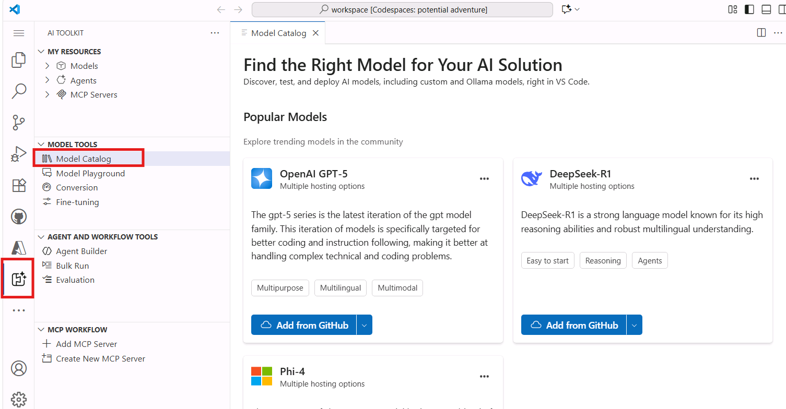
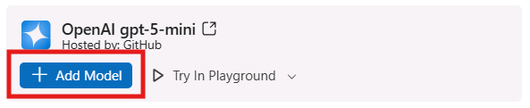
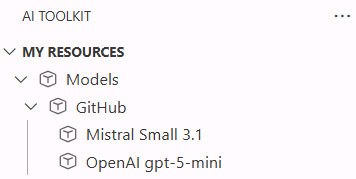
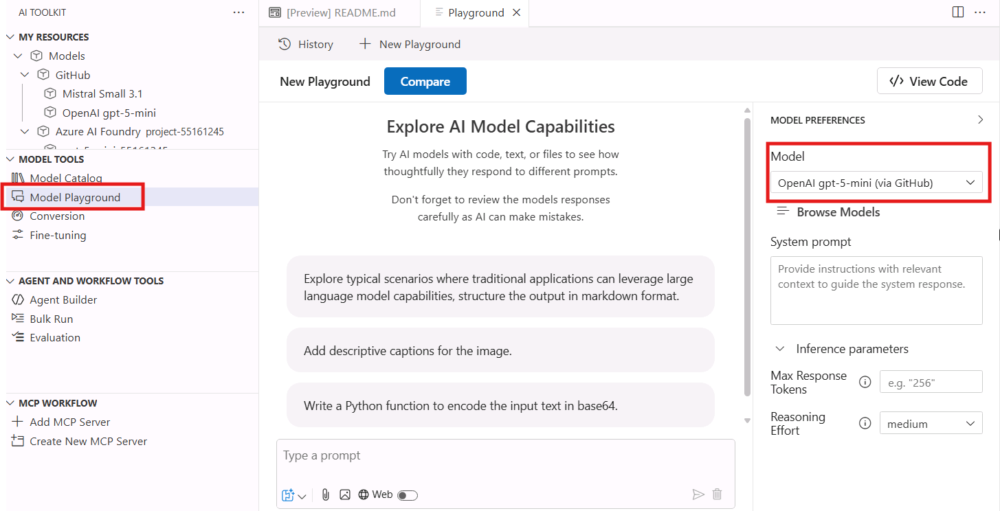
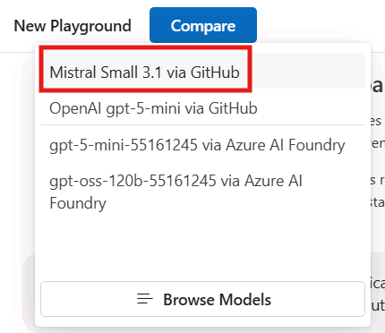

# Model Selection: Exploring the AI Toolkit Model Catalog

In this section, you will explore the AI Toolkit Model Catalog to discover, filter, and compare models for your multimodal agent project. The Model Catalog provides access to models from various providers including GitHub, Azure AI Foundry, OpenAI, and others.

## Step 1: Apply Filters to Narrow Your Selection

1. In your Codespace, locate the **AI Toolkit** extension icon in the left sidebar
2. Click on the AI Toolkit icon to open the extension panel
3. Click on **Model Catalog** to browse available models



On the top of the page you'll find the most popular models; scroll down to see the full list of available models.

Since the list is quite consistent, you can use the filtering options to narrow down the selection based on your requirements.

### Filter by Hosting Provider

1. Click on the **Hosted by** filter dropdown. You have several options, such as GitHub, Azure AI Foundry, OpenAI and you can even leverage models hosted on your local infrastructure, through Ollama or ONNX.
2. Select **GitHub** to view free-to-use models that are excellent for prototyping.

> [!NOTE]
> GitHub models are perfect for getting started because they're free to use, but they are token-rate limited. You can experiment without cost concerns, but for production deployments, consider using a pay-as-you-go offering through your GitHub Account or Azure AI Foundry.

### Filter by Model Features

1. Click on the **Features** filter dropdown to filter by model capabilities, such as image/audio or video processing, tool calling, etc.
2. Select **Image Attachment** to find multimodal models that support visual input processing and enables multimodal interactions combining text and images.

### Filter by Publisher

1. Click on the **Publisher** filter dropdown to filter by the model publisher, such as Microsoft, Meta, Cohere, etc. Note that you can find both open-source and proprietary models.
2. Select **OpenAI** and **Mistral AI** to view models from these two leading providers.

## Step 2: Add Models to Your Collection

After applying filters, you'll see a refined list of models. For this exercise:

1. Locate the **GPT-5-mini** and **Mistral Small 3.1** models in the filtered results.
   - **GPT-5-mini** is a full-featured multimodal model with comprehensive capabilities
   - **Mistral Small 3.1** is an optimized smaller model with faster response times and lower costs.
2. Click **Add model** on each model tile to add them to your collection.



> [!NOTE]
> Once they are added, the blue button will change to green with the label **Added**. 

## Step 3: Open the Playground for Testing

1. Click on **Playground** in the AI Toolkit panel. The Playground allows you to test and compare models interactively.
2. You'll be prompted to login to your GitHub account to access the free-tier models. Click **Allow** and complete the authentication process, by using the same GitHub credentials you used in the [previous lab section](./01_Get_Started.md).

>![TIP]
> Now that you are logged in, you should be able to see the models you added into your collection in the 'My resources' tab, under 'GitHub'.



3. In the **Model** field, select one of the two GitHub-hosted models you added to your collection, for example **OpenAI gpt-5-mini (via GitHub)**. It will be loaded into the Playground automatically.



4. Next, click the **Compare** button to enable side-by-side comparison
5. From the dropdown, select your second model (Mistral Small 3.1 if GPT-5-mini is already selected)
6. You now have two models ready for comparison testing



## Step 4: Test Multimodal Capabilities

To test the models' image processing capabilities:

1. Enter this prompt in the text field:
   ```
   Describe what's in the image, including colors of the objects.
   ```

2. Click the attachment icon to add an image
3. Select an image file to upload (you can use any relevant image for testing)
4. Click **Run** to execute the prompt on both models simultaneously

## Step 5: Analyze and Compare Results

Review the outputs from both models:

- **Response Quality**: Compare the depth and accuracy of descriptions
- **Detail Level**: Which model provides more comprehensive analysis?
- **Processing Time**: Note any differences in response speed
- **Cost Considerations**: Factor in the pricing differences for production use

> [!TIP]
> The side-by-side comparison allows you to see exactly how different models handle the same input, making it easier to choose the best fit for your specific use case.

## Step 6: Consider Production Deployment Options

After selecting your preferred model based on testing:

1. Return to the **Model Catalog**
2. Look for the same model offered through **Azure AI Foundry** hosting
3. Consider the benefits of Azure AI Foundry hosting for production:
   - Enterprise-grade security and compliance
   - Service Level Agreements (SLAs)
   - Enhanced performance and scalability
   - Integration with other Azure services

> [!NOTE]
> While GitHub models are excellent for prototyping, Azure AI Foundry hosted models provide the enterprise features needed for production deployments.

## Key Takeaways

- The Model Catalog provides a comprehensive view of available AI models from multiple providers
- Filtering capabilities help you quickly identify models that match your specific requirements
- Model comparison in the Playground enables data-driven decision making
- Different hosting options offer varying benefits for different stages of development
- Multimodal capabilities can be tested effectively using the built-in comparison tools

This exploration process ensures you select the most appropriate model for your specific use case, balancing factors like performance, cost, features, and deployment requirements.