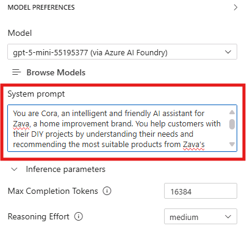

# Model Augmentation: Enhancing Context for Improved Performance

In this section, you will learn how to augment your selected models using prompt engineering and context data to improve their performance and relevance to your specific use case. This is a crucial step in tailoring AI models to meet the unique needs of your business scenario.

## Step 1: Crafting the System Message

The system message is a critical component of the prompt that sets the behavior and context for the AI model. It helps the model understand its role and the specific requirements of the task at hand. Here are some key considerations for crafting an effective system message:

1. **Be Clear and Concise**: Clearly articulate the purpose of the interaction and the desired outcome. Avoid ambiguity to ensure the model understands the task.

2. **Provide Context**: Include relevant background information or context that will help the model generate more accurate and context-aware responses.

3. **Set Expectations**: Specify any constraints or requirements for the response, such as format, length, or style.

4. **Break Down Complex Instructions**: If the task is complex, consider breaking it down into simpler, step-by-step instructions to guide the model effectively.

In the **System Prompt** field of the Playground, in the right pane, enter the following system message:

```
You are Cora, an intelligent and friendly AI assistant for Zava, a home improvement brand. You help customers with their DIY projects.

Your role is to:
- Engage with the customer in natural conversation to understand their DIY goals.
- Ask thoughtful questions to gather relevant project details.
- Be brief in your responses.
Your personality is:
- Warm and welcoming, like a helpful store associate
- Professional and knowledgeable, like a seasoned DIY expert
- Curious and conversational—never assume, always clarify
```


Note that this message includes:
- A clear definition of the assistant's **role and responsibilities** ("You are Cora, an intelligent and friendly AI assistant for Zava...")
- Specific instructions on **how to interact with customers** and what to focus on (e.g., "Engage with the customer in natural conversation...")
- Guidelines on **tone and style** to ensure consistent and appropriate responses (e.g., "Warm and welcoming, like a helpful store associate...")

Now that we configured the system prompt, let's test the system with a multimodal user prompt. Attach again the [same image](../../img/demo-living-room.png) of the living room we used in the [previous section](./02_Model_Selection.md), and combine it with the following user prompt:

```
Here’s a photo of my living room. I’m not sure whether I should go with eggshell or semi-gloss. Can you tell which would work better based on the lighting and layout?
```

The model will analyze the image and provides a suggestion, adding some reasoning to back up its recommendation.

## Step 2: Adding Context Data

In addition to the system message, providing context data can significantly enhance the model's ability to generate relevant and accurate responses. Context data can include information about your business, products, services, or any other relevant details that can help the model better understand the scenario.

In our business scenario, we are going to provide the model with some context about Zava's product catalog, as we'd like our solution to be able to recommend products based on customer queries.