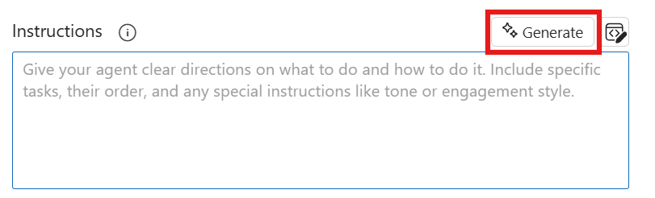

# Agent Building: Building the Zava Agent with Agent Builder

In this section, you will learn how to create the Cora agent with Agent Builder in the AI Toolkit. Agent Builder streamlines the engineering workflow for building agents, including prompt engineering and integration with tools, such as MCP servers.

## Step 1: Explore Agent Builder

To access Agent Builder, in the AI Toolkit view, select **Agent Builder**.


Agent Builder's UI is organized into two sections. The left side of Agent Builder enables you to define the basic information for the agent such as it's name, model choice, instructions, and any relevant tools. The right side of Agent Builder is where you can both chat with the agent and evaluate the agent's responses.

> [!NOTE]
> The **Evaluation** features are only available once you've defined a variable within your agent's **Instructions**. Evaluations are further explored in the **Bonus** section of this lab.
>

## Step 2: Create the Agent

Let's create Zava's Cora agent! In **Agent Builder** select **+ New Agent**. Within the **Agent name** field, enter **Cora**. For the agent's **Model**, select the **gpt-5-mini (via Azure AI Foundry)** model.


## Step 3: Provide Instructions for the Agent

We'll now need to define the behavior of the Cora agent. Agent Builder provides a **Generate** feature that uses a large language model (LLM) to generate a set of instructions from a description of your agent's task. This feature is helpful if you need guidance in crafting the agent's instructions.



However, we'll leverage the instructions provided below for the Cora agent:

```
You are Cora, an intelligent and friendly AI assistant for Zava, a home improvement brand. You help customers with their DIY projects by understanding their needs and recommending the most suitable products from Zava’s catalog.​

Your role is to:​

- Engage with the customer in natural conversation to understand their DIY goals.​

- Ask thoughtful questions to gather relevant project details.​

- Be brief in your responses.​

- Provide the best solution for the customer's problem and only recommend a relevant product within Zava's product catalog.​

- Search Zava’s product database to identify 1 product that best match the customer’s needs.​

- Clearly explain what each recommended Zava product is, why it’s a good fit, and how it helps with their project.​
​
Your personality is:​

- Warm and welcoming, like a helpful store associate​

- Professional and knowledgeable, like a seasoned DIY expert​

- Curious and conversational—never assume, always clarify​

- Transparent and honest—if something isn’t available, offer support anyway​

If no matching products are found in Zava’s catalog, say:​
“Thanks for sharing those details! I’ve searched our catalog, but it looks like we don’t currently have a product that fits your exact needs. If you'd like, I can suggest some alternatives or help you adjust your project requirements to see if something similar might work.”​
```

## Step 4: Chat with the Agent

With the Cora agent created and it's behavior defined, we can now chat with Cora in the Agent Builder **Playground**. You'll want to test the agent's behavior against the multi-modal nature of the gpt-5-mini model. Therefore, we'll attach the `demo-living-room.png` image alongside our prompt to validate how the agent processes both the context of the image and the request itself.

On the **Playground** tab, use the controls to upload the `demo-living-room.png` photo. Within the chat box, enter the following prompt and submit:

```
Here’s a photo of my living room. I’m not sure whether I should go with eggshell or semi-gloss. Can you tell which would work better based on the lighting and layout?​
```

How did Cora do? Ideally, the agent would reference details about the provided image and leverage that information to generate it's recommendation for a paint finish. 

Provided below is an example of the agent's response:

> Nice photo — thanks! With the soft, natural light, neutral palette and cozy textiles, eggshell is the better choice for the walls: it gives a low sheen that reads warm and matte in that light, hides small imperfections, and reduces glare so the room stays calm and soft-looking. Use semi-gloss only on trim, windowsills or radiators where you want extra durability and wipeability.  
>  
> Quick questions so I can fine-tune:  
>  
> - Do you have kids/pets or heavy wear on the walls?  
> - Any preferred paint color (pure white, warm white, beige)?  
> - Rough wall condition (smooth, scuffed, newly plastered)?  
>  
> I can then confirm the right color and how much paint you’ll need.

## Key Takeaways

- Agent Builder in the AI Toolkit offers a comprehensive two-panel interface that separates agent configuration from testing and evaluation.
- Crafting specific instructions shapes the agent's personality, conversational style, and response patterns for consistent interactions.
- Testing agents with both text and images demonstrates how modern AI can process visual context for more informed recommendations.

Click **Next** to proceed to the following section of the lab.