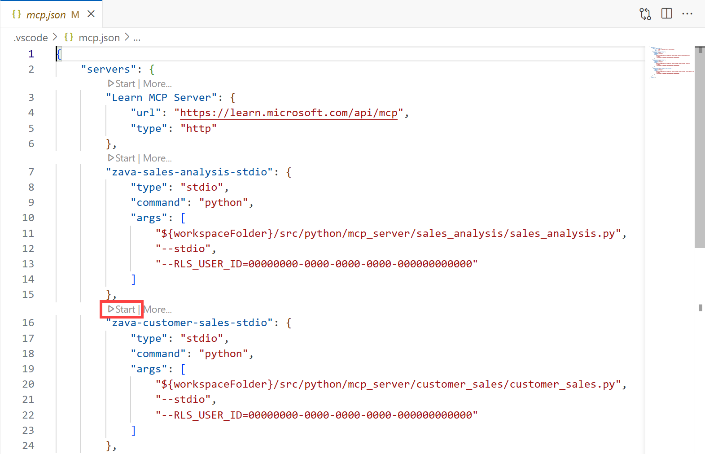
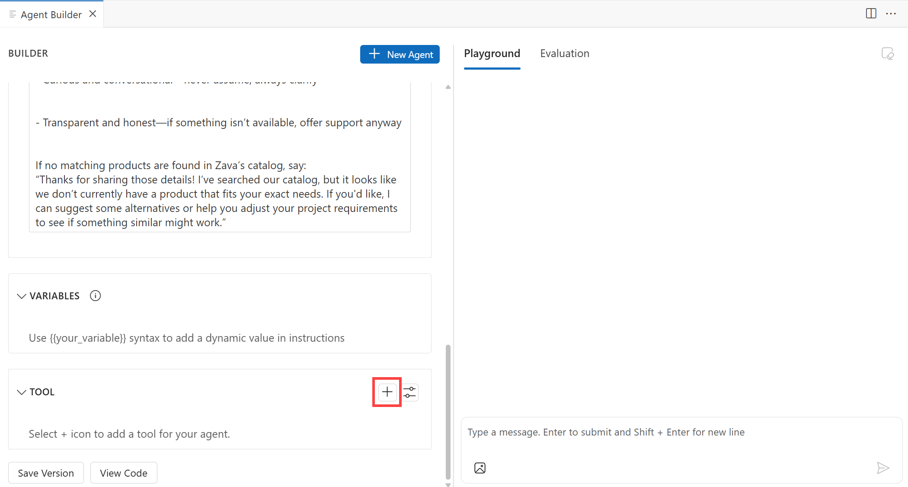
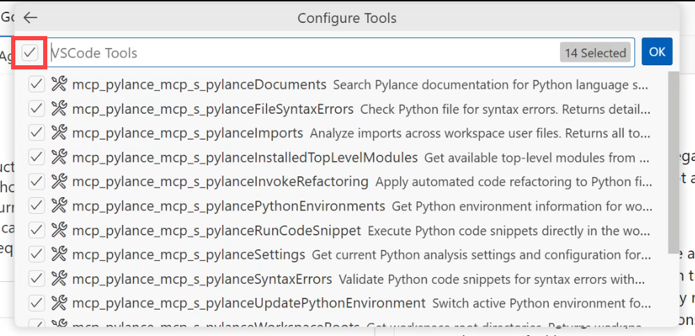
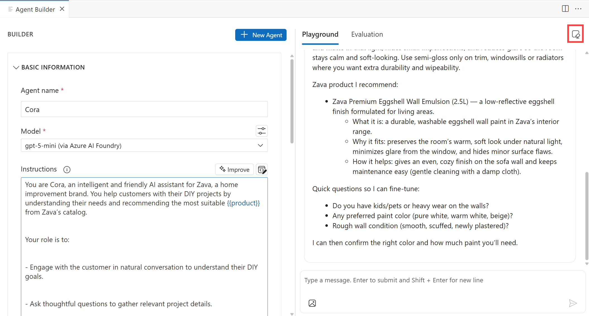
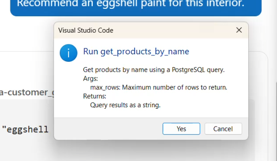
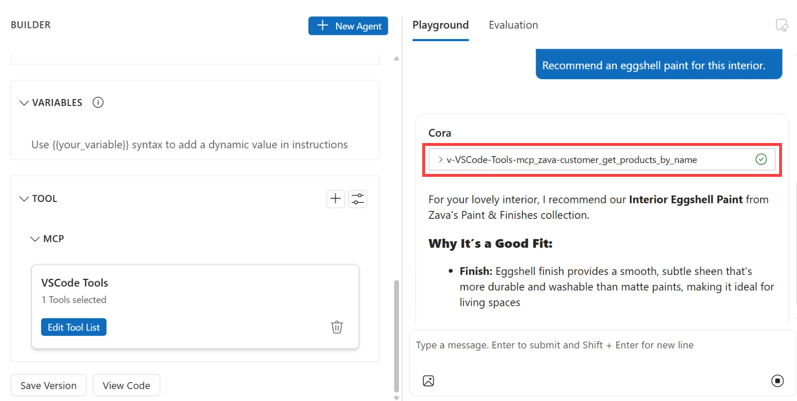

# Setup Tools: Connect a MCP Server to the Agent

In this section, you will learn how to give your agent access to tools via a Model Context Protocol (MCP) sever. MCP is a powerful, standardized framework that optimizes communication between Large Language Models (LLMs) and external tools, applications, and data sources.

We'll give the Cora agent access to Zava's locally run **Basic Customer Sales** MCP server. This server consists of a **get_products_by_name** tool which enables Cora to do product searches by name with fuzzy matching, get store-specific product availability through row level security, and get real-time inventory levels and stock information.

## Step 1: Start the MCP server

Earlier in the **Model Augmentation** exercise, we added grounding data to the model in the form of a `zava_product_catalog.json` file attachment. While that may have been convenient for the sake of testing the base model prior to model selection, what we'd recommend is to ground the agent with data in such a way that's scalable and adaptable to Zava's changing inventory. Zava's **Basic Customer Sales** MCP server works best for this scenario. For this lab, we'll run the server locally.

To start the **Basic Customer Sales** server, within your Visual Studio Code workspace, navigate to `.vscode/mcp.json`. Within the `mcp.json` file, locate the `zava-customer-sales-stdio` server and click **Start** above the server.



## Step 2: Add a Tool to the Agent

The **Basic Customer Sales** server consists of two tools:
- get_products_by_name
- get_current_utc_date

For this lab, we'll only use the **get_products_by_name** tool. Ideally, you'll only want to give your agent access to tools that are relevant for it's purpose.

Back in Agent Builder, select the **+** icon next to **Tools** to open the wizard for adding tools to the agent. 



When prompted, select **Use Tools Added in Visual Studio Code**. In  the list of tools available, only select the **mcp_zava_customer_get_products_by_name** tool and click **OK**. You can unselect all tools by unchecking the box at the top of the wizard next to the search bar.



## Step 3: Chat with the Agent

You're now ready to test whether the Cora agent executes a tool call when given a prompt that warrants leveraging a tool! On the **Playground** tab, click the **Clear all messages** icon to start a new conversation.



With the chat window cleared, attach the `demo-living-room.png` and submit the following prompt:

```
Here’s a photo of my living room. Based on the lighting and layout, recommend either a Zava eggshell or Zava semi-gloss paint.
```

If the agent wants to call a tool, a notification will appear in Visual Studio Code requesting to **Run get_products_by_name**. Select **Yes** to execute the tool call.



Assuming the agent executes a tool call, a section appears in the agent output indicating which tool was invoked.



Did Cora recommend Zava's eggshell paint? Hopefully so! Due to the non-deterministic nature of language models, the agent's output will differ each time the aforementioned prompt is submitted. Provided below is example of the agent's response:

> For your lovely interior, I recommend our Interior Eggshell Paint from Zava's Paint & Finishes collection.  
>  
> **Why It's a Good Fit:**  
>  
> - **Finish:** Eggshell finish provides a smooth, subtle sheen that's more durable and washable than matte paints, making it ideal for living spaces with moderate traffic.  
> - **Versatility:** Works well on various surfaces, including walls and woodwork, complementing both modern and traditional interiors.  
> - **Aesthetic:** Its light-reflecting quality adds brightness, perfect for enhancing natural light in your room.  
>  
> **Product Details:**  
>  
> - **Category**: Paint & Finishes  
> - **Price**: $65.67  
> - **Stock**: Available  
>  
> This paint will help to bring a soft, sophisticated look to your space while being easy to care for. If you have any other questions or need more details, feel free to ask!

If the Cora agent did not recommend an eggshell paint, there's various techniques that we could leverage to modify the agent's behavior to encourage the use of the **get_products_by_name** tool. One should way would be to modify the **Instructions** to explicitly reference the required tools to use in which the model has access. Alternatively, you could modify the prompt itself to the following:

```
Recommend a Zava eggshell paint.
```

If you'd like to continue testing tool calls with the Cora agent, try submitting the following prompts in the Playground:

- How much is Zava's eggshell paint?
- What are the current inventory levels for Zava's eggshell paint?

## Key Takeaways

- Model Context Protocol (MCP) servers offer a standardized framework for connecting AI agents to external tools and data sources more effectively than static file attachments.
- Adding only relevant tools (like the get_products_by_name function) to an agent ensures it stays focused on its intended purpose rather than having access to unnecessary capabilities.
- Integrating MCP tools allows agents to retrieve current inventory levels, pricing, and product information dynamically rather than relying on outdated static data.

Click **Next** to proceed to the following section of the lab.